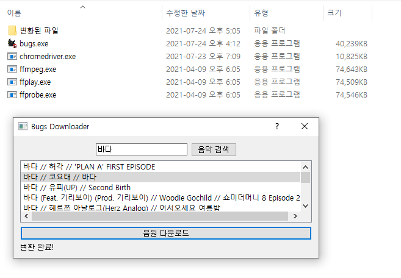

# Bugs-Music-Downloader

[벅스](https://music.bugs.co.kr/)로 부터 음악을 검색하고, 검색된 음악 정보를 바탕으로 유튜브에서 음원을 다운받아 mp3 파일로 만듭니다. mp3 파일은 제목, 아티스트, 앨범 정보가 같이 크롤링 되어 생성됩니다.

## 사용방법
* [여기](https://github.com/Hydragon516/Bugs-Music-Downloader/releases)에서 최신 파일을 다운받습니다.
* 압축을 해제하고 [여기](https://chromedriver.chromium.org/downloads)에서 본인의 크롬 버전과 동일한 최신 크롬 드라이버를 다운받습니다.
* 다운받은 드라이버는 압축 해제한 폴더에 넣어두면 됩니다.
* bugs.exe를 실행합니다. (실행시 나오는 검은 터미널 창은 무시하세요.)

## 업데이트
* 2021/07/24 - 최초 커밋
